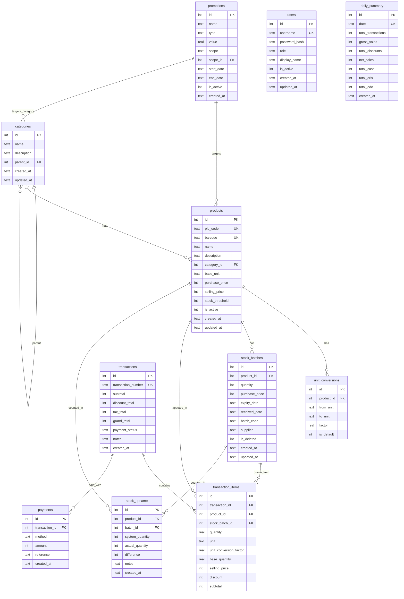

# Entity Relationship Diagram — POS Grosir

## 1. Diagram ERD (Mermaid)

## 2. Penjelasan Tabel

### categories
Menyimpan kategori produk (contoh: "Minuman", "Sembako", "Produk Segar").
Mendukung sub-kategori via kolom `parent_id` (self-referencing FK).
- Relasi: satu kategori memiliki banyak produk.

### products
Menyimpan data master produk.
- `base_unit`: satuan terkecil yang digunakan untuk stok (contoh: `pcs`, `gram`, `ml`).
- `plu_code`: kode PLU untuk produk tanpa barcode (contoh: "PLU-001").
- `stock_threshold`: batas minimum stok untuk peringatan stok menipis.
- Semua harga disimpan dalam satuan rupiah (integer, nominal terkecil).
- Relasi: belongsTo kategori; memiliki banyak konversi satuan, batch stok, dan riwayat transaksi.

### unit_conversions
Menyimpan konversi antar satuan untuk satu produk.
- Contoh: produk "Minyak Goreng 1L" — base_unit = `ml`.
  - `from_unit: "dus"`, `to_unit: "pcs"`, `factor: 12` (1 dus = 12 pcs)
  - `from_unit: "pcs"`, `to_unit: "ml"`, `factor: 1000` (1 pcs = 1000 ml)
- `is_default`: menandai konversi default untuk tampilan di keranjang.
- Stok internal selalu tersimpan dalam `base_unit` produk. Saat transaksi, stok dikonversi menggunakan faktor rantai konversi.

### stock_batches
Mencatat setiap penerimaan stok sebagai batch terpisah (untuk FIFO dan penelusuran kedaluwarsa).
- `quantity`: jumlah stok dalam `base_unit` produk.
- `purchase_price`: harga beli per `base_unit` untuk batch ini.
- `expiry_date`: tanggal kedaluwarsa produk.
- `is_deleted`: soft-delete untuk penyesuaian stok opname.
- Relasi: belongsTo produk; dipakai oleh transaction_items (FIFO).

### transactions
Menyimpan header setiap transaksi penjualan.
- `transaction_number`: format `TRX-YYYYMMDD-NNNN` (auto-increment per hari).
- `payment_status`: `completed` (lunas), `voided` (dibatalkan), `refunded` (retur).
- Relasi: memiliki banyak item transaksi dan banyak pembayaran.

### transaction_items
Menyimpan detail item per transaksi.
- `stock_batch_id`: menunjukkan batch mana yang terpakai (FIFO).
- `quantity` / `unit`: jumlah yang dijual dalam satuan yang dipilih kasir (bisa dus/pcs/gram).
- `unit_conversion_factor`: faktor konversi dari `unit` ke `base_unit` saat transaksi. Contoh: jual 2 dus, factor = 12, maka `base_quantity` = 24.
- `base_quantity`: stok yang terpakai dalam `base_unit` (untuk pengurangan stok yang akurat).
- Relasi: belongsTo transaksi; belongsTo produk; belongsTo batch stok.

### payments
Menyimpan setiap metode pembayaran dalam satu transaksi (sebuah transaksi bisa cash + QRIS + EDC sekaligus).
- `method`: `cash`, `qris`, `edc`.
- `reference`: nomor referensi dari EDC atau QRIS.
- Relasi: belongsTo transaksi.

### promotions
Menyimpan aturan diskon dan promo.
- `type`: `percentage` (diskon %) atau `nominal` (diskon rupiah).
- `scope`: `product` (per produk), `category` (per kategori), `all` (semua produk).
- `scope_id`: ID produk atau kategori yang dituju (NULL jika scope='all').
- Relasi: belongsTo produk (opsional); belongsTo kategori (opsional).

### users
Menyimpan akun pengguna sistem.
- `role`: `admin` (pemilik toko, akses penuh), `cashier` (kasir, hanya transaksi & laporan).
- `password_hash`: bcrypt hash (proses hash di Rust side).
- `is_active`: menonaktifkan user tanpa menghapus.

### stock_opname
Mencatat hasil stok opname (hitung fisik).
- `system_quantity`: stok di sistem.
- `actual_quantity`: stok hasil hitung fisik.
- `difference`: selisih (actual - system), bisa negatif (susut) atau positif (lebih).
- Setelah opname, sistem akan membuat adjustment batch (`is_deleted` + batch baru dengan sisa stok).
- Relasi: belongsTo produk; belongsTo batch stok.

### daily_summary
Menyimpan rekap harian yang di-generate saat tutup kasir.
- Mempermudah laporan tanpa harus kalkulasi ulang dari transaksi.
- `date` UNIQUE: satu baris per hari.
- Relasi: tidak ada FK — data agregat.

## 3. Representasi Konversi Satuan

**Konsep dasar:**
- Setiap produk memiliki satu `base_unit` (pcs, gram, ml, dll).
- Stok internal hanya disimpan dalam `base_unit`.
- `unit_conversions` mendefinisikan rantai konversi.

**Contoh produk "Minyak Goreng":**
- `base_unit`: `ml`
- `unit_conversions`:
  | from_unit | to_unit | factor |
  |---|---|---|
  | dus | pcs | 12 |
  | pcs | ml | 1000 |

- Kasir bisa menjual dalam satuan `dus` (2 dus = 24 pcs = 24000 ml).
- Stok berkurang 24000 ml dari batch yang dipilih (FIFO).

**Contoh produk "Telur":**
- `base_unit`: `gram`
- `unit_conversions`:
  | from_unit | to_unit | factor |
  |---|---|---|
  | pcs | gram | 60 |
  | kg | gram | 1000 |

- Kasir menjual 1 kg = 1000 gram; stok berkurang 1000 gram.
